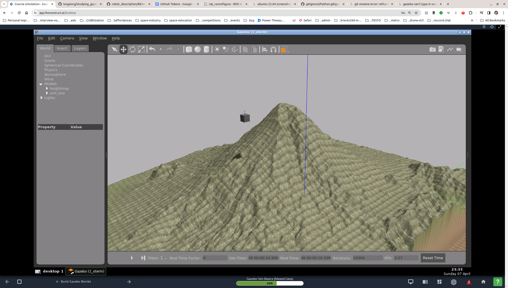

### studying_gazebo

Exercises with Gazebo worlds, models, etc.

### ROS Services

1. The `/gazebo/pause_physics` and `/gazebo/unpause_physics` can be very useful to simulate the behavior of objects that have to be translated accurately.
   1. Spawn the object.
   2. `rosservice call /gazebo/pause_physics` on the command line.
   3. Translate the object as needed.
   4. `rosservice call /gazebo/upause_physics` on the command line. _The physics can be paused before spawning the object._
   5. To see available services, `rosservice list` on the command line.

     

### References

1. [Gazebo models (Github)](https://github.com/osrf/gazebo_models).
2. [SDF format](http://sdformat.org/spec?elem=geometry).

